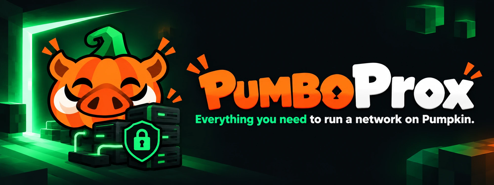
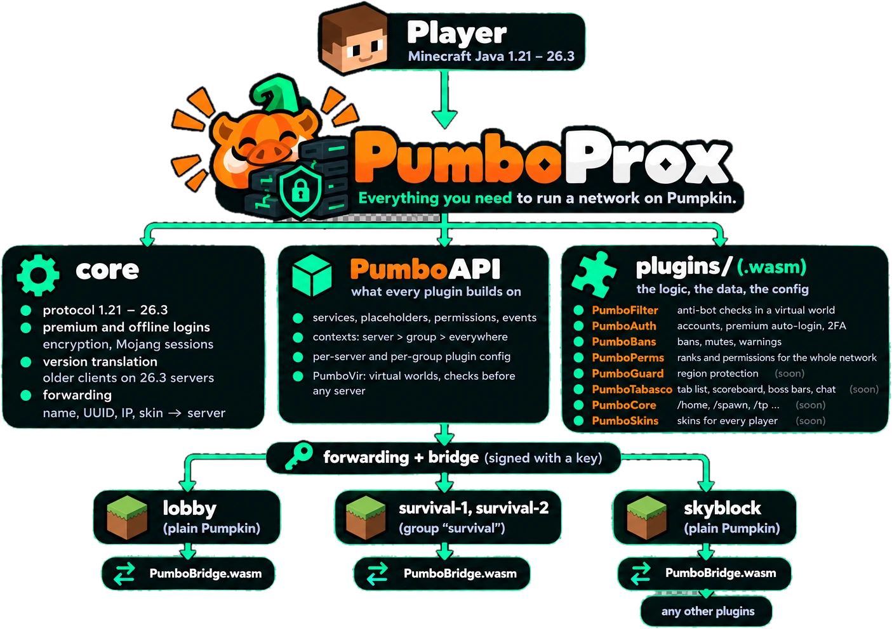
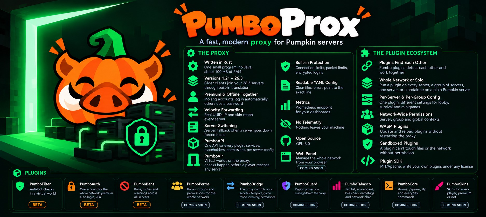

<p align="center">
  
</p>

<p align="center">
  <a href="LICENSE"></a>
  
  
  <a href="https://github.com/Pumpkin-MC/Pumpkin"></a>
  
  
  
</p>

<p align="center">
  <b>PumboProx</b> sits in front of your <a href="https://github.com/Pumpkin-MC/Pumpkin">Pumpkin</a> servers, the way Velocity sits in front of Paper.<br>
  Players connect to one address, log in once and move between servers. Plugins run on the proxy as small WebAssembly files.
</p>

<p align="center">
  <a href="#the-proxy">The proxy</a> ·
  <a href="#the-plugins">The plugins</a> ·
  <a href="#get-started">Get started</a> ·
  <a href="#roadmap">Roadmap</a> ·
  <a href="#writing-plugins">Writing plugins</a> ·
  <a href="#known-issues">Known issues</a> ·
  <a href="CONTRIBUTING.md">Contributing</a> ·
  <a href="SECURITY.md">Security</a>
</p>

<table>
<tr>
<td width="50%" valign="top">

**🧱 1.21 – 26.3**<br>
Players on older clients join your 26.3 servers. The proxy translates the protocol.

</td>
<td width="50%" valign="top">

**👤 Premium + offline**<br>
Mojang accounts log in on their own, everyone else uses a password. Decided per player.

</td>
</tr>
<tr>
<td valign="top">

**🧩 WASM plugins**<br>
One file in `plugins/`. Each plugin runs in a sandbox and reloads while players stay online.

</td>
<td valign="top">

**🛡️ Checked before they join**<br>
Bot checks and logins happen in a virtual world on the proxy, before a player reaches any server.

</td>
</tr>
</table>

---

## See it in action

https://github.com/user-attachments/assets/224d9859-b9b5-4844-a02f-295abef80e18

Two players on one network: the bot check in a virtual world, a premium login without a password, a new account with `/register`, `/server` between lobby and survival, and a ban that follows the player across the whole network.

> [!NOTE]
> PumboProx is in **beta** (0.1.1-beta). Everything marked as available below works and is covered by tests against real Pumpkin servers. Try it on a test network before you put players on it.

<a name="the-proxy"></a>
<p align="center"></p>

| | Feature | |
| --- | --- | --- |
| ⚙️ | **Written in Rust** | One small program, no Java. About 20 MB of RAM on its own; each plugin adds about 20 MB, so about 100 MB with Filter, Auth, Bans and Perms. |
| 🧱 | **Versions 1.21 – 26.3** | Players on older clients join your 26.3 servers. The proxy translates the protocol. |
| 👤 | **Premium and offline together** | Mojang accounts log in automatically, everyone else uses a password (with PumboAuth). Decided per player. |
| ➡️ | **Velocity modern forwarding** | The real UUID, IP and skin reach every server. Pumpkin supports it out of the box. |
| 🔀 | **Server switching** | `/server`, `/glist`, `/send`, `/find`, `/alert`, a fallback server when one goes down, forced hosts. |
| 🧩 | **PumboAPI** | One API for every plugin: services, placeholders, permissions, per-server and per-group config. |
| 🌌 | **PumboVir** | Virtual worlds on the proxy. Bot checks and logins happen before a player reaches any server. |
| 🌉 | **PumboBridge** | Moving players between servers works without it. With PumboBridge on a server, the proxy can also act inside it: teleport within the world, change game modes, read inventories, apply its ranks and see the server's TPS. |
| 🛡️ | **Built-in protection** | Connection limits, packet limits, flood kicks, encrypted logins. |
| 📄 | **Readable YAML config** | Plain files with comments. Errors point to the exact line. |
| 📊 | **Metrics** | A Prometheus endpoint for your dashboards. |
| 🙈 | **No telemetry** | Nothing leaves your machine. |

<a name="the-plugins"></a>
<p align="center"></p>

| | Feature | |
| --- | --- | --- |
| 📦 | **One file per plugin** | Drop the plugin's `.wasm` file into `plugins/`. On the first start the plugin creates its folder and a commented `config.yml`. |
| 🔗 | **Plugins find each other** | Pumbo plugins detect each other and work together. Take one away and the rest keep running. |
| 🌍 | **Whole network or solo** | Run a plugin on the proxy for the whole network, or standalone on a plain Pumpkin server. |
| 🗂️ | **Per-server and per-group config** | One plugin, different settings for lobby, survival and minigames. |
| 🔐 | **Network-wide permissions** | Server, group and global contexts in one `permissions.yml`. |
| ♻️ | **Reload without a restart** | Update a plugin and reload it while players stay online. |
| 🧪 | **Sandboxed plugins** | A plugin sees only its own config and data folders and has no network access. |
| 🧰 | **Plugin SDK** | MIT/Apache-2.0. Write your own plugins under any license. |

### Pumbo plugins

Every plugin keeps its logic in one place and comes in two builds: one for the proxy (the whole network) and one for a plain Pumpkin server.

| Plugin | What it does | Proxy | Pumpkin | Status |
| --- | --- | :---: | :---: | --- |
| 🛡️ [**PumboFilter**](https://github.com/PumboMC/PumboFilter) | Anti-bot checks in a virtual world | ✅ | ✅ |  |
| 🔒 [**PumboAuth**](https://github.com/PumboMC/PumboAuth) | One account for the whole network, premium auto-login, passwords, 2FA | ✅ | ✅ |  |
| 🚫 [**PumboBans**](https://github.com/PumboMC/PumboBans) | Bans, mutes and warnings across all servers | ✅ | ✅ |  |
| 👥 [**PumboPerms**](https://github.com/PumboMC/PumboPerms) | Ranks, groups and permissions for the whole network, imports what you already have | ✅ | ✅ |  |
| 🌉 [**PumboBridge**](https://github.com/PumboMC/PumboBridge) | Lets the proxy act inside each server: teleports within the world, game modes, inventories, ranks, TPS | ✅ | ✅ |  |
| 🏰 **PumboGuard** | Region protection, managed from the proxy | 🔜 | 🔜 |  |
| 📋 **PumboTabasco** | Tab list, scoreboard, boss bars, name tags and network chat (`/tbsc`) | 🔜 | |  |
| 🏠 **PumboCore** | `/home`, `/spawn`, `/tp` and everyday commands | 🔜 | 🔜 |  |
| 🎨 **PumboSkins** | Skins for every player, premium or not | 🔜 | |  |

### Plugins work together

You don't wire anything up. Each Pumbo plugin looks for the others when it starts and uses what it finds. Take one away and the rest keep running on their own.

| When you have | What happens |
| --- | --- |
| **PumboFilter + PumboAuth** | A new player passes the bot check and goes straight to the login, in the same connection, with no reconnect screen. |
| **PumboFilter + PumboBans** | Addresses that keep failing the bot check get a temporary IP ban through PumboBans (`auto-ban` in the config). |
| **PumboBans + PumboAuth** | A ban ends the player's login sessions, so after the ban is lifted they type their password again. |
| **PumboPerms on the proxy + PumboBridge** | Ranks you set on the proxy with `/pp` apply on every server right away. A PumboPerms that also runs on a server steps back and lets the proxy decide. |
| **Any plugin + PumboBridge** | The plugin can teleport players within a server's world, change game modes or open inventories on any server, and read `%server_tps:lobby%` and other placeholders. |

### PumboBridge

PumboBridge is a small plugin you put on every Pumpkin server behind the proxy. It is the same file and the same `config.yml` on all of them.

1. Turn on `bridge:` in `pumboprox.yml`. The proxy creates a key on the first start (`/prox bridge key` shows it).

   

2. Put `PumboBridge.wasm` into `plugins/` of each server, with the proxy's address and the key in its `config.yml`.
3. Each server connects to the proxy on its own and finds out which server it is. `/prox bridge` shows them all:


With the bridge, the proxy and its plugins can:

| | |
| --- | --- |
| 🧭 **Move players** | on the server: teleport within a world, to another world, to spawn or to another player, and send a player to a server with a teleport after they arrive |
| 🎮 **Change their state** | game mode, health, effects, flight |
| 🎒 **Look into inventories** | read them and show a player's inventory to staff |
| 🔐 **Apply ranks** | the proxy's permissions become the server's permissions, so `/gamemode` on lobby can be allowed for one rank and not on survival |
| 📊 **Read the server** | TPS, MSPT and player data as placeholders, and events like join, death and world change |

Every message between the proxy and a server is signed with the key, so a fake proxy or a fake server is refused. A server without PumboBridge still works behind the proxy; plugins just can't control it, and they are told so.

### How it fits together



Players connect to the proxy. It checks them, logs them in and sends them to a server with Velocity forwarding, so every server sees the real UUID, IP and skin. Moving players between servers needs nothing more. Every server also runs PumboBridge, so the proxy can act inside it as well: teleport players within the world, change game modes and apply its ranks there.

<details>
<summary>Text version</summary>

```
Player (Minecraft Java 1.21 – 26.3)
   │
   ▼
PumboProx ──────────────────────────────── one program (Rust), one config
├── core
│   ├── protocol 1.21 – 26.3
│   ├── premium and offline logins       encryption, Mojang sessions
│   ├── version translation              older clients on 26.3 servers
│   └── forwarding                       name, UUID, IP, skin → server
│
├── PumboAPI ─────────────────────────── what every plugin builds on
│   ├── services, placeholders, permissions, events
│   ├── contexts: server > group > everywhere
│   ├── per-server and per-group plugin config
│   └── PumboVir: virtual worlds, checks before any server
│
└── plugins/ (.wasm) ─────────────────── the logic, the data, the config
    ├── PumboFilter    anti-bot checks in a virtual world
    ├── PumboAuth      accounts, premium auto-login, 2FA
    ├── PumboBans      bans, mutes, warnings
    ├── PumboPerms     ranks and permissions for the whole network
    ├── PumboGuard     region protection                        (soon)
    ├── PumboTabasco   tab list, scoreboard, boss bars, chat    (soon)
    ├── PumboCore      /home, /spawn, /tp …                     (soon)
    └── PumboSkins     skins for every player                   (soon)
   │
   │  forwarding + bridge (signed with a key)
   ├──────────────────────┬────────────────────────┐
   ▼                      ▼                        ▼
lobby                  survival-1, survival-2    skyblock
(plain Pumpkin)        (group "survival")        (plain Pumpkin)
└─ PumboBridge.wasm    └─ PumboBridge.wasm       ├─ PumboBridge.wasm
                                                 └─ any other plugins
```

</details>

<details>
<summary><b>How a player gets in</b>: PumboFilter and PumboAuth hold a new player in a virtual world on the proxy until the checks and the login are done</summary>

```
Player joins
   │
   ▼
Login on the proxy ──────────────────────── before encryption
   ├── PumboFilter   counts connections, attack mode, auto-ban of addresses that keep failing
   └── PumboAuth     refuses bad nicknames, locked accounts, new players while registrations are closed
   │
   ▼
Gates in a virtual world (PumboVir) ─────── no server sees the player yet
   │
   ├── 1. PumboFilter                       gate "filter"
   │      ├── let through: premium (outside an attack), verified in the last 12 h,
   │      │                whitelist, pumbo.filter.bypass
   │      ├── gravity check      falls for 6.4 s, compared with vanilla physics
   │      ├── client check       brand and settings of the game
   │      ├── CAPTCHA if needed  a code on a map in hand → /captcha <code>
   │      └── passed → next gate in the same connection, no reconnect screen
   │
   └── 2. PumboAuth                         gate "auth"
          ├── premium            logged in by Mojang, no password
          ├── session            joined from here in the last 60 min
          ├── new player         /register <password> <password>
          ├── known player       /login <password>   (+ /2fa <code> with 2FA on)
          ├── countdown bar, lockout after wrong passwords, argon2id
          └── logged in → a server
   │
   ▼
lobby (Pumpkin) ─────────────────────────── /changepassword, /logout, /2fa, /premium
                                            are taken by the proxy and never reach a server
```

</details>

Plugins from the Pumpkin market keep working on your servers as usual. The proxy only adds what a network needs on top.

<a name="get-started"></a>
<p align="center"></p>

**1. Get PumboProx.** Pick one:

- **Download** the file for your system from [Releases](https://github.com/PumboMC/PumboProx/releases/latest): Linux (x86_64 and ARM64, also static builds), Windows (x86_64 and ARM64) or macOS. Unpack it and you have the `pumboprox` program.
- **Docker**: an image for `linux/amd64` and `linux/arm64`, `ghcr.io/pumbomc/pumboprox:<version>` (`latest` is the newest stable release). It holds only the program and runs as a non-root user. Put `pumboprox.yml` into a directory and mount it as `/data`; whatever the proxy writes (secrets, data, `plugins/`) lands there too.

  ```sh
  mkdir pumbo && cd pumbo        # pumboprox.yml goes here
  docker run -dit --name pumboprox -p 25565:25565 \
    -v "$PWD:/data" --user "$(id -u):$(id -g)" \
    ghcr.io/pumbomc/pumboprox:latest
  ```

  Inside the container `127.0.0.1` is the container itself: give the servers in `pumboprox.yml` addresses the container can reach (another container's name on the same Docker network, or `--network host` on Linux). Console: `docker attach pumboprox`, leave it with Ctrl+P Ctrl+Q. `docker stop pumboprox` shuts the proxy down cleanly.
- **Build from source** (Rust stable):

  ```sh
  git clone https://github.com/PumboMC/PumboProx
  cd PumboProx
  cargo build --release -p pumbo-prox
  ```

**2. Configure it.** `pumboprox.yml`:

```yaml
listener:
  - bind: "0.0.0.0:25565"
status:
  motd: "&6My network"
  max-players: 100
login:
  online-mode: per-player      # per-player | true | false
servers:
  lobby:    { address: "127.0.0.1:25566", protocol: 777 }
  survival: { address: "127.0.0.1:25567", protocol: 777 }
routing:
  try: [lobby]
forwarding:
  mode: modern                 # modern | none (none: tests only)
  secret-file: forwarding.secret
plugins:
  dir: plugins
```

**3. Point your Pumpkin servers at it.**

> [!TIP]
> Run your servers on Pumpkin 0.2.0 (Minecraft 26.3): then players on every version from 1.21 to 26.3 can join.

In each server's `pumpkin.toml`, turn on Velocity forwarding with the secret from `forwarding.secret`, and let the server listen on `127.0.0.1` only:

```toml
[networking.proxy]
enabled = true

[networking.proxy.velocity]
enabled = true
secret = "<contents of forwarding.secret>"
```

On Pumpkin 0.2.0, read the [warning under Known issues](#known-issues) first.

**4. Start it:**

```sh
./pumboprox run pumboprox.yml     # Docker starts it for you
```

**5. Add plugins.** Put the `.wasm` files into `plugins/` and restart the proxy, or load them with `/prox plugins load <id>`.


### Servers from the proxy

PumboProx can download Pumpkin, create servers, run them and add them to the
network without a restart. It is meant for the owner of a network on one
machine: no customer accounts, no resource quotas. It is off by default.

```yaml
managed-servers:
  enabled: true
  dir: servers                # server folders, servers.yml, templates/, .trash/
  versions-dir: versions      # downloads, versions/<software>/<tag>/
  ports: 25700-25799          # ports of new servers (127.0.0.1)
  download-from-game: false   # /prox download from the game; the console always can
  allow-unverified: false     # accept releases without a SHA256 checksum
  stop-timeout-secs: 30       # after "stop" on the console, then a kill
  templates:
    default:
      source: pumpkin
      version: latest         # the newest downloaded release, or a tag
      autostart: true         # start right after `new` and with the proxy
      restart-on-crash: 3     # restarts within 10 minutes, then it stays down
```

From the console (or the game, with the permissions below):

```
prox download                      # what can be downloaded, what is downloading
prox download pumpkin              # numbered list of releases, newest first
prox download pumpkin #2           # download one (by number or tag), SHA256 checked
prox servers new arena              # folder, pumpkin.toml, plugins from the template
prox servers start arena            # then: /server arena
prox servers                       # state, version, port, players, memory, uptime
prox servers logs arena 30
prox servers stop|restart arena
prox servers delete arena confirm   # stops it and moves the folder to servers/.trash/
```

<details><summary>How it works, the way into the network, permissions</summary>

- Downloads come only from the Pumpkin-MC/Pumpkin GitHub releases, with the
  file for this machine, and are checked against the release's
  `checksums.sha256`. Development builds (canary, nightly) have no checksums
  and are refused unless `allow-unverified: true`.
- Each new server gets its own `pumpkin.toml`: a random seed, `127.0.0.1` and
  a free port of `ports`, offline mode behind the proxy, Velocity forwarding
  with the proxy's secret. Telemetry stays at Pumpkin's default; the file
  says how to turn it off. With the bridge on, PumboBridge gets its
  `config.yml` (address and key). Everything in
  `servers/templates/<template>/` (for example `plugins/PumboBridge.wasm`) is
  copied into the server.
- A server is `ready` when its port answers. A crashed server is restarted
  after 1, 5 and 15 seconds, at most `restart-on-crash` times in 10 minutes.
- When the proxy stops, it stops its servers (`stop` on their console, a kill
  after `stop-timeout-secs`). If the proxy itself dies, the servers keep
  running and the next start takes them over (their PID is in
  `servers/servers.yml`).
- The player who starts a download sees its progress on a boss bar (percent,
  speed, size); the console logs it every 10%. `prox download stop [name]`
  stops one download or all of them and leaves no partial file.
- Servers in `servers:` of the config win over servers from the proxy with
  the same name. `routing.try` and `forced-hosts` may name servers from the
  proxy. Changes to `managed-servers` itself need a restart.

#### The way into the network

`/prox route` shows the way a player takes: domains with servers of their
own (`forced-hosts`), the gates of plugins in order (required or optional),
the servers of `routing.try` and the fallback. Every step can be changed
from the game or the console; the change is written to `pumboprox.yml`
(only that key, comments stay) and applied at once:

```
prox route servers add arena 1           # try arena first
prox route servers move lobby 1
prox route host set play.example.org arena
prox route host remove play.example.org
prox route gates require auth            # no login without the auth gate
```

Permissions: `pumbo.proxy.route` to look, `pumbo.proxy.route.edit` to change.
A domain never skips the gates.

| Command | Permission |
| --- | --- |
| `/prox download [pumpkin\|paper] [#n\|version]`, `/prox download stop …` | `pumbo.proxy.download` |
| `/prox servers` | `pumbo.proxy.servers` |
| `/prox servers new <name> [#n\|tag\|latest] [template]` | `pumbo.proxy.servers.create` |
| `/prox servers start\|stop\|restart <name>` | `pumbo.proxy.servers.control` |
| `/prox servers logs <name> [lines]` | `pumbo.proxy.servers.logs` |
| `/prox servers delete <name> confirm` | `pumbo.proxy.servers.delete` |

Without a permission plugin these belong to `commands.operators` and the
console.

</details>

### Commands

| Command | What it does |
| --- | --- |
| `/server <server>` | Go to another server, or list them |
| `/send <player\|all\|current> <server>` | Move players to a server |
| `/prox` | The proxy commands you may use (help with pages and tooltips) |
| `/prox servers` | Servers run by the proxy |
| `/pf` `/pa` `/pb` `/pp` | PumboFilter, PumboAuth, PumboBans, PumboPerms |

<details><summary>All proxy commands</summary>

| Command | What it does | Permission |
| --- | --- | --- |
| `/server [server]` | Go to another server, or list them | `pumbo.proxy.server` |
| `/glist` | Players on every server | `pumbo.proxy.glist` |
| `/send <player\|all\|current> <server>` | Move players to a server | `pumbo.proxy.send` |
| `/find <player>` | Which server a player is on | `pumbo.proxy.find` |
| `/alert <message>` | A message to the whole network | `pumbo.proxy.alert` |
| `/prox [help] [page]` | The proxy commands you may use | |
| `/prox version` | The proxy's version and the protocols it speaks | |
| `/prox reload` | Reload `pumboprox.yml` | `pumbo.proxy.reload` |
| `/prox plugins [reload\|load\|unload <id>]` | Plugins, their versions and state; manage them while the proxy runs | `pumbo.proxy.plugins`, changes: `.plugins.manage` |
| `/prox bridge [key]` | Which servers run PumboBridge, and the bridge key | `pumbo.proxy.bridge`, key: `.bridge.key` |
| `/prox route …` | The way into the network: domains, gates, servers | `pumbo.proxy.route`, changes: `.route.edit` |
| `/prox download …` | Download server software | `pumbo.proxy.download` |
| `/prox servers …` | Create and run servers | `pumbo.proxy.servers.*` |
| `/prox debug perms\|services` | How a permission is decided; plugin services | `pumbo.proxy.debug` |

In the proxy console the same commands work without the slash. `/pumbo` lists the Pumbo plugins; a click opens a plugin's help.

</details>

<details><summary>Plugin commands</summary>

| Plugin | Command | Short |
| --- | --- | --- |
| PumboFilter | `/pumbofilter` | `/pf` |
| PumboAuth | `/pumboauth` | `/pa` |
| PumboBans | `/pumbobans` | `/pb` |
| PumboPerms | `/pumboperms` | `/pp` |

Player commands such as `/login` or `/ban`, and their aliases, are listed in each plugin's README.

</details>

Permissions live in `permissions.yml`, with server, group and global contexts:

```yaml
groups:
  default:
    permissions: [pumbo.proxy.server]
  staff:
    inherits: [default]
    permissions:
      - "pumbo.proxy.*"
      - "pumbo.bans.*"
players:
  Steve:
    groups: [staff]
```

## Roadmap

| | What | |
| --- | --- | --- |
| ✅ | Core proxy, forwarding, server switching | done |
| ✅ | Plugin host (PumboAPI), virtual worlds (PumboVir) | done |
| ✅ | Version translation 1.21 – 26.2 → 26.3 | done |
| ✅ | PumboFilter, PumboAuth, PumboBans, PumboBridge | beta |
| ✅ | PumboPerms for the whole network | beta |
| ✅ | 0.1.0-beta.1: downloads for Linux, macOS and Windows, Docker image | released |
| ✅ | Server management from the proxy: download Pumpkin, create and manage servers (idea by [@Uncover-F](https://github.com/Uncover-F)) | released (0.2.0-beta) |
| 🔜 | Paper servers from the proxy: download and run them like Pumpkin | next |
| 🔜 | HTTP API for panels and hosting: servers, players, bans | next |
| 🔜 | Pterodactyl and Pelican egg, setup wizard, signed Windows files | next |
| 🔜 | Translation in both directions (newer clients on older servers) | planned |
| 🔜 | PumboDB, PumboTabasco, PumboGuard, PumboCore, PumboSkins | planned |
| 🔜 | Web panel built into the proxy | planned |
| 🔜 | Clients older than 1.21, in our own translator | planned |
| 🔜 | Bedrock players | planned |
| 🔜 | PumboSkins | planned |

## Writing plugins

A PumboProx plugin is a WebAssembly component built against the [`pumbo:prox` WIT interface](https://github.com/PumboMC/PumboProx/tree/main/wit/pumbo-prox.wit). The [SDK (`pumbo-sdk`)](https://github.com/PumboMC/PumboProx/tree/main/crates/pumbo-sdk) and the interface are MIT/Apache-2.0, so your plugin can use any license.

| | What | Where |
| --- | --- | --- |
| 🧰 | **SDK**: commands, events, config, languages, services, `embed!`, a fake host for tests | [`crates/pumbo-sdk`](https://github.com/PumboMC/PumboProx/tree/main/crates/pumbo-sdk) |
| 📜 | **Interface**: the contract between the proxy and a plugin, usable from any language that builds WebAssembly components | [`wit/pumbo-prox.wit`](https://github.com/PumboMC/PumboProx/tree/main/wit/pumbo-prox.wit) |
| 🤝 | **Contracts**: shared service types, so plugins can talk to each other | [`crates/pumbo-contracts`](https://github.com/PumboMC/PumboProx/tree/main/crates/pumbo-contracts) |
| 🧩 | **Shared library**: YAML config, languages and message styles used by the Pumbo plugins | [`crates/pumbo-common`](https://github.com/PumboMC/PumboProx/tree/main/crates/pumbo-common) |
| 🌱 | **Example plugin** to copy | [`plugins/example`](https://github.com/PumboMC/PumboProx/tree/main/plugins/example) |

The SDK is not on crates.io yet. Add it from Git:

```toml
[dependencies]
pumbo-sdk = { git = "https://github.com/PumboMC/PumboProx" }
```

```sh
rustup target add wasm32-wasip2
cargo build -p pumbo-example --target wasm32-wasip2 --profile plugin
```

[`plugins/example`](https://github.com/PumboMC/PumboProx/tree/main/plugins/example) is a small plugin with a command, a config file and a placeholder. Start there.

## Known issues

> [!WARNING]
> **Pumpkin 0.2.0 lets every player use `/tp`, `/xp`, `/banip` and `/pardonip`.** In the official 0.2.0 release (and in 0.1.0-dev) these aliases skip the permission check of the command they stand for, so on a plain server anyone can teleport, give experience and ban IP addresses. Pumpkin fixed it after 0.2.0 ([#3801](https://github.com/Pumpkin-MC/Pumpkin/pull/3801)). PumboBridge and PumboPerms block the four aliases on the server for players without the permission. If you run neither of them, update Pumpkin to a build with the fix.

- **Tab completion for plugin commands is partial.** For a plugin command the proxy suggests the plugin's subcommands and then the names of online players. Suggestions for every argument (durations, group names, servers) come once plugins can answer completions themselves.
- A server on the older Pumpkin 0.1.0-dev (Minecraft 26.2) accepts only 26.2 players for now; every version will be able to join it once the translation works in both directions.
- **This release:** PumboProx with [PumboFilter](https://github.com/PumboMC/PumboFilter), [PumboAuth](https://github.com/PumboMC/PumboAuth), [PumboBans](https://github.com/PumboMC/PumboBans), [PumboPerms](https://github.com/PumboMC/PumboPerms) and [PumboBridge](https://github.com/PumboMC/PumboBridge). Each plugin has its own repository and its own release with the `.wasm` files.
- **PumboDB, PumboTabasco, PumboGuard, PumboCore and PumboSkins are planned**, not part of this release. PumboDB will be one shared SQL database (SQLite, MySQL, MariaDB, PostgreSQL) for all Pumbo plugins.
- `/prox download paper` answers "coming soon": Paper servers from the proxy come in a later beta.

## Contributing

Bug reports, fixes and plugins are welcome. [CONTRIBUTING.md](CONTRIBUTING.md) explains how to build the proxy, run the tests and start a test network on your machine with one command. Report security problems privately, as described in [SECURITY.md](SECURITY.md).

## License

PumboProx is licensed under the [GNU General Public License v3.0](LICENSE). The plugin SDK, the WIT interface and the shared libraries for plugins are dual-licensed under MIT and Apache-2.0.

PumboProx is not affiliated with Mojang, Microsoft or the Pumpkin project.

<details>
<summary>Everything on one picture</summary>
<br>

</details>
