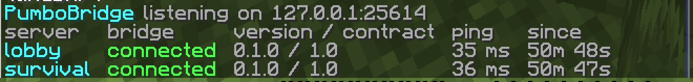

[PumboProx](../README.md) · [Get started](getting-started.md) · [Servers from the proxy](servers.md) · [Commands](commands.md) · **PumboBridge** · [How it works](how-it-works.md) · [Writing plugins](writing-plugins.md)

---

# PumboBridge

[PumboBridge](https://github.com/PumboMC/PumboBridge) is a small plugin you put on every Pumpkin server behind the proxy. It is the same file and the same `config.yml` on all of them. Moving players between servers works without it; with it, the proxy can also act inside each server.

## Set it up

1. Turn on `bridge:` in `pumboprox.yml`. The proxy creates a key on the first start (`/prox bridge key` shows it).

   

2. Put `PumboBridge.wasm` into `plugins/` of each server, with the proxy's address and the key in its `config.yml`. Servers the proxy runs for you get this `config.yml` on their own; put `PumboBridge.wasm` into `servers/templates/default/plugins/` once and every new server gets it too.
3. Each server connects to the proxy on its own and finds out which server it is. `/prox bridge` shows them all:

## What the proxy can do with it

| | |
| --- | --- |
| 🧭 **Move players** | on the server: teleport within a world, to another world, to spawn or to another player, and send a player to a server with a teleport after they arrive |
| 🎮 **Change their state** | game mode, health, effects, flight |
| 🎒 **Look into inventories** | read them and show a player's inventory to staff |
| 🔐 **Apply ranks** | the proxy's permissions become the server's permissions, so `/gamemode` on lobby can be allowed for one rank and not on survival |
| 📊 **Read the server** | TPS, MSPT and player data as placeholders, and events like join, death and world change |

Every message between the proxy and a server is signed with the key, so a fake proxy or a fake server is refused. A server without PumboBridge still works behind the proxy; plugins just can't control it, and they are told so.
